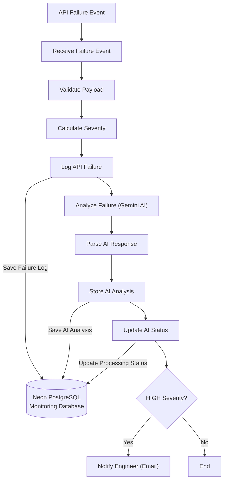
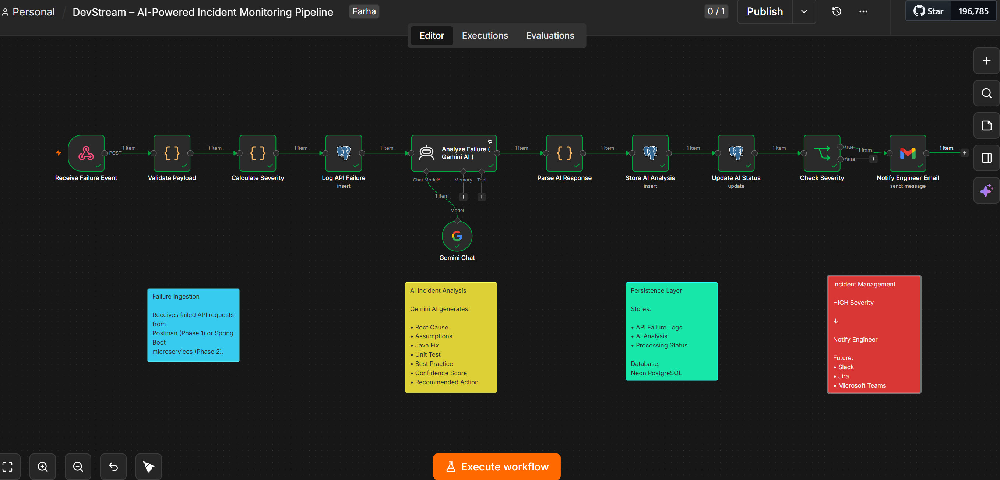
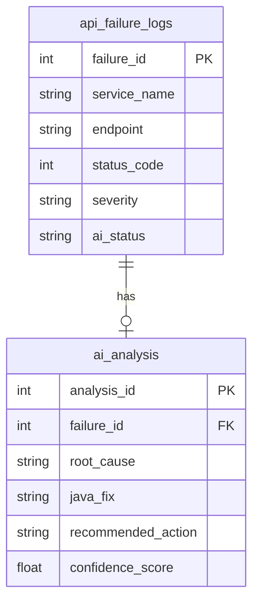

# DevStream – AI-Powered Incident Monitoring Pipeline


AI-powered incident monitoring pipeline built with n8n, Gemini AI, and PostgreSQL to automate API failure analysis and engineer notifications.

## Project Overview

DevStream is an AI-powered incident monitoring pipeline built using **n8n**, **Gemini AI**, and **Neon PostgreSQL**.

The project automates API failure handling by receiving failure events, validating requests, calculating incident severity, generating AI-assisted root cause analysis, storing incident data in PostgreSQL, and notifying engineers about high-severity incidents.

It demonstrates workflow automation, AI integration, database persistence, and event-driven incident management in a backend engineering scenario.

## Project Flow

```text
API Failure Event
      │
      ▼
Webhook
      │
      ▼
Payload Validation
      │
      ▼
Severity Calculation
      │
      ▼
PostgreSQL Failure Log
      │
      ▼
Gemini AI Analysis
      │
      ▼
Store AI Analysis
      │
      ▼
HIGH Severity?
      │
      ▼
Engineer Notification
```

## Features

- AI-assisted root cause analysis using **Gemini AI**
- Automated incident severity calculation
- PostgreSQL persistence for API failures and AI analysis
- Conditional email notifications for HIGH-severity incidents
- Workflow automation using **n8n**
- Structured storage of AI-generated analysis and recommendations
- Extensible architecture for future Spring Boot integration

## Tech Stack

| Category | Technology |
|----------|------------|
| Workflow Automation | n8n |
| AI Model | Gemini AI |
| Database | Neon PostgreSQL |
| Database Engine | PostgreSQL |
| Notification | Gmail |
| API Testing | Postman |
| Version Control | GitHub |
| Future Event Source | Spring Boot Microservice |

## Architecture Diagram



> **Current Event Source:** Postman for API failure simulation
>
> **Workflow Trigger:** n8n HTTP Webhook
>
> **Planned Event Source:** Spring Boot Microservice (Phase 2)

## Workflow Screenshot

The following screenshot shows the complete implementation of the AI-powered incident monitoring pipeline in **n8n**.



## Demo

### Sample Workflow Execution

1. API failure event is sent using Postman.
2. n8n validates the payload and calculates severity.
3. Failure details are stored in Neon PostgreSQL.
4. Gemini AI analyzes the incident and generates:
   - Root cause
   - Java fix recommendation
   - Unit test suggestion
   - Best practice
   - Confidence score
5. AI analysis is stored in PostgreSQL.
6. HIGH severity incidents trigger an automated email notification to the designated engineer.

## Database Schema

The project uses **Neon PostgreSQL** to store both raw API failure events and AI-generated incident analysis.

The following diagram presents a simplified view of the primary database fields and relationships.

The database consists of two primary tables:

| Table | Purpose |
|-------|---------|
| `api_failure_logs` | Stores API failure details received by the workflow |
| `ai_analysis` | Stores AI-generated analysis linked to each API failure |



Each API failure is stored first in `api_failure_logs`.

After AI processing, the generated root cause analysis, Java fix recommendations, confidence score, and other outputs are stored in `ai_analysis` using the corresponding `failure_id`.

## Sample API Payload

The workflow receives API failure events through an HTTP Webhook.

Example request:

```json
{
  "serviceName": "Order Service",
  "endpoint": "/api/orders",
  "httpMethod": "POST",
  "statusCode": 500,
  "responseTimeMs": 2400,
  "errorMessage": "NullPointerException while creating order",
  "stackTrace": "java.lang.NullPointerException..."
}
```

## Setup Guide

### Prerequisites

- n8n Cloud or self-hosted n8n
- Google Gemini API Key
- Neon PostgreSQL
- Gmail Account
- Postman

### Installation

1. Clone the repository.
2. Create the PostgreSQL tables using the SQL scripts.
3. Import the n8n workflow JSON.
4. Configure the Gemini API credentials.
5. Configure PostgreSQL credentials.
6. Configure Gmail credentials.
7. Activate the workflow.
8. Send the sample payload using Postman.
9. Verify the AI analysis and database entries.

## Security

This repository intentionally excludes all secrets and sensitive credentials.

The exported n8n workflow contains only references to credentials—not the actual values.

After importing the workflow, configure your own credentials in n8n for:

- Google Gemini API
- Neon PostgreSQL
- Gmail OAuth

Never commit:

- API keys
- Database passwords
- Connection strings
- OAuth tokens
- `.env` files
- Exported credentials

## Future Enhancements

### Phase 2

- Replace Postman with Spring Boot Microservice
- Automatic failure reporting
- Exception handling integration

### Planned Improvements

- Slack notifications
- Jira integration
- Monitoring dashboard
- Incident analytics
- Retry recommendations
- Historical incident search
- Docker deployment

## Project Structure

```text
DevStream/
│
├── README.md
├── workflow/
│   └── DevStream_AI_Incident_Monitoring.json
├── database/
│   ├── create_tables.sql
│   └── sample_data.sql
├── images/
│   └── workflow.png
└── LICENSE
```

## Project Status

**Current Phase**

Phase 1 – AI-powered incident monitoring workflow using Postman for event simulation.

**Next Phase**

Integrate a Spring Boot microservice to automatically report API failures to the n8n workflow.

## Repository Contents

- `workflow/` – n8n workflow export
- `database/` – PostgreSQL schema and sample data
- `images/` – Architecture and workflow screenshots
- `README.md` – Project documentation

## License

This project is licensed under the MIT License. See the `LICENSE` file for details.
