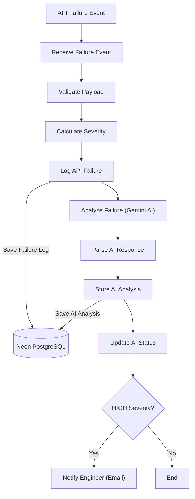
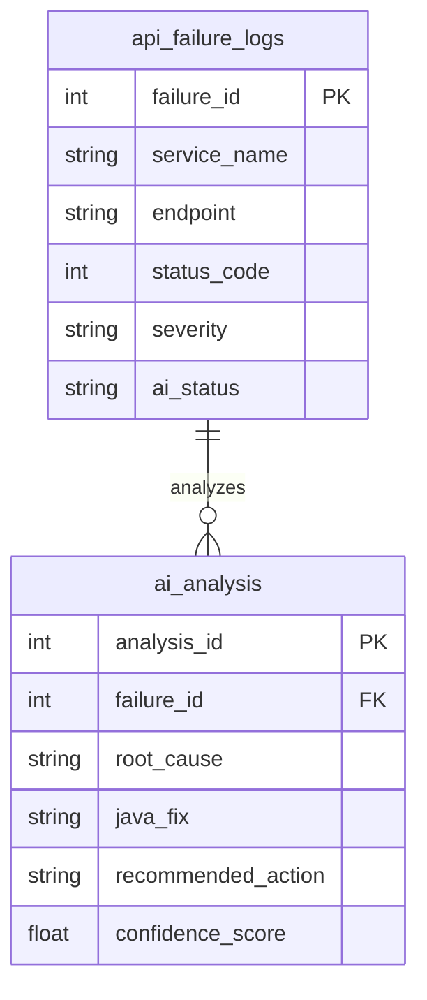

# DevStream – AI-Powered Incident Monitoring Pipeline

## Project Overview

DevStream is an AI-powered incident monitoring pipeline built using **n8n**, **Gemini AI**, and **Neon PostgreSQL**.

The workflow receives API failure events, validates incoming requests, calculates incident severity, performs AI-assisted root cause analysis, stores incident data and AI recommendations in PostgreSQL, and sends email notifications for high-severity incidents.

The project demonstrates workflow automation, AI integration, database persistence, and incident management in a backend monitoring scenario.

## Features

- AI-assisted root cause analysis using **Gemini AI**
- Automated incident severity calculation
- PostgreSQL persistence for API failures and AI analysis
- Conditional email notifications for HIGH-severity incidents
- Workflow automation using **n8n**
- Structured storage of AI-generated analysis and recommendations
- Extensible architecture for future Spring Boot integration

## Tech Stack

| Category | Technology |
|----------|------------|
| Workflow Automation | n8n |
| AI Model | Gemini AI |
| Database | Neon PostgreSQL |
| Database Engine | PostgreSQL |
| Notification | Gmail |
| API Testing | Postman |
| Version Control | GitHub |
| Future Event Source | Spring Boot Microservice |

## Architecture Diagram



> **Current Trigger:** Postman (Phase 1 – Testing)
>
> **Planned Trigger:** Spring Boot Microservice (Phase 2)

## Workflow Screenshot

The following screenshot shows the complete implementation of the AI-powered incident monitoring pipeline in **n8n**.


## Database Schema

The project uses **Neon PostgreSQL** to store both raw API failure events and AI-generated incident analysis.

The database consists of two primary tables:

| Table | Purpose |
|-------|---------|
| `api_failure_logs` | Stores API failure details received by the workflow |
| `ai_analysis` | Stores AI-generated analysis linked to each API failure |



Each API failure is stored first in `api_failure_logs`.

After AI processing, the generated root cause analysis, Java fix recommendations, confidence score, and other outputs are stored in `ai_analysis` using the corresponding `failure_id`.

## Sample API Payload

The workflow receives API failure events through an HTTP Webhook.

Example request:

```json
{
  "serviceName": "Order Service",
  "endpoint": "/api/orders",
  "httpMethod": "POST",
  "statusCode": 500,
  "responseTimeMs": 2400,
  "errorMessage": "NullPointerException while creating order",
  "stackTrace": "java.lang.NullPointerException..."
}
```

## Setup Guide

### Prerequisites

- n8n Cloud
- Google Gemini API Key
- Neon PostgreSQL Database
- Gmail Account
- Postman (for Phase 1 testing)

### Steps

1. Clone this repository.
2. Import the n8n workflow.
3. Configure Gemini API credentials.
4. Configure Neon PostgreSQL credentials.
5. Configure Gmail credentials.
6. Execute the workflow using the sample payload.
