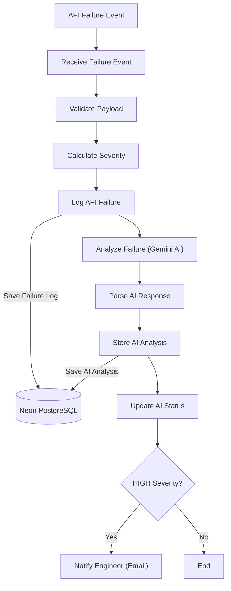

# DevStream – AI-Powered Incident Monitoring Pipeline

## Project Overview

DevStream is an AI-powered incident monitoring pipeline built using **n8n**, **Gemini AI**, and **Neon PostgreSQL**.

The workflow receives API failure events, validates incoming requests, calculates incident severity, performs AI-assisted root cause analysis, stores incident data and AI recommendations in PostgreSQL, and sends email notifications for high-severity incidents.

The project demonstrates workflow automation, AI integration, database persistence, and incident management in a backend monitoring scenario.

## Features

- AI-assisted root cause analysis using **Gemini AI**
- Automated incident severity calculation
- PostgreSQL persistence for API failures and AI analysis
- Conditional email notifications for HIGH-severity incidents
- Workflow automation using **n8n**
- Structured storage of AI-generated analysis and recommendations
- Extensible architecture for future Spring Boot integration

## Tech Stack

| Category | Technology |
|----------|------------|
| Workflow Automation | n8n |
| AI Model | Gemini AI |
| Database | Neon PostgreSQL |
| Database Engine | PostgreSQL |
| Notification | Gmail |
| API Testing | Postman |
| Version Control | GitHub |
| Future Event Source | Spring Boot Microservice |

## Architecture Diagram

> **Current Trigger:** Postman (Phase 1 – Testing)
>
> **Planned Trigger:** Spring Boot Microservice (Phase 2)

## Workflow Screenshot

The following screenshot shows the complete implementation of the AI-powered incident monitoring pipeline in **n8n**.

