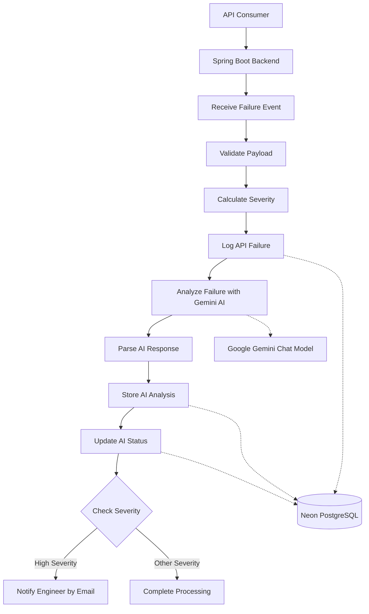

# DevStream – Phase 2 Architecture

| Item | Details |
|------|---------|
| Release | Phase 2 |
| Version | v2.0 |
| Status | Final |
| Last Updated | July 2026 |
| Author | Farha Serin Naaz |
| Related Release | Release 1 → Release 2 |

---

## Introduction

This document describes the architecture of DevStream Release 2.

Release 2 extends the AI-powered monitoring platform introduced in Release 1 by integrating a Spring Boot backend with the existing n8n workflow. The architecture preserves the workflow-driven design while introducing a dedicated backend entry point for incoming API requests.

This document describes the architectural components, their responsibilities, interactions, and the design decisions that support the implementation of Release 2.

## Architecture Goals

The architecture of Release 2 is designed to achieve the following objectives:

- Separate backend services from workflow orchestration.
- Maintain a modular architecture that supports independent component evolution.
- Enable AI-assisted incident analysis without tightly coupling AI services to the backend.
- Provide reliable persistence for monitoring data and AI-generated insights.
- Support future enhancements through extensible system design.
- Improve maintainability, scalability, and readability of the overall platform.

## High-Level System Architecture

Release 2 extends the architecture introduced in Release 1 by integrating a Spring Boot backend as the primary entry point for incoming API requests. The existing n8n workflow remains unchanged and continues to orchestrate the end-to-end incident analysis process.

The following diagram illustrates the high-level execution flow and the interactions between the workflow and its external services.

### Architecture Overview

The processing flow begins when an API consumer submits a failed API request to the Spring Boot backend. The backend validates and forwards the request to the existing n8n workflow for processing.

Within the workflow, the incoming payload is validated, the incident severity is calculated, and the API failure is recorded in Neon PostgreSQL. The workflow then invokes the Google Gemini Chat Model to perform AI-assisted incident analysis. After processing the AI response, the generated analysis is stored, the incident status is updated, and the workflow evaluates the incident severity to determine whether an engineer notification should be sent.

The workflow interacts with Neon PostgreSQL for persistent storage, Google Gemini for AI-powered analysis, and the email notification service for conditional alerting. Together, these components provide an automated architecture for incident detection, AI-assisted analysis, data persistence, and notification.

## System Components

The following table summarizes the primary components of the Release 2 architecture and their responsibilities.

| Component | Responsibility |
|-----------|----------------|
| **Spring Boot Backend** | Acts as the primary entry point for incoming API requests, validates request data, and forwards requests to the workflow orchestration layer. |
| **n8n Workflow Engine** | Orchestrates the end-to-end incident analysis workflow by coordinating AI analysis, database operations, and notification services. |
| **Google Gemini API** | Performs AI-powered analysis of failed API requests and generates root cause analysis, probable causes, and recommended resolutions. |
| **PostgreSQL Database** | Stores incident information, AI-generated analysis, workflow results, and monitoring data for persistence and reporting. |
| **Email Notification Service** | Delivers automated incident notifications containing AI-generated insights to the configured recipients. |

## Component Interactions

The Release 2 architecture consists of loosely coupled components that collaborate to automate API incident analysis.

The Spring Boot backend serves as the primary entry point for incoming API requests and forwards validated requests to the existing n8n workflow. The workflow acts as the orchestration layer, coordinating validation, incident processing, AI analysis, database operations, and notification services.

During execution, the workflow interacts with Neon PostgreSQL to persist incident records, AI-generated analysis, and workflow status. It also communicates with the Google Gemini Chat Model to generate AI-assisted root cause analysis and recommended resolutions. When an incident is classified as high severity, the workflow triggers the email notification service to alert the configured recipients.

This separation of responsibilities improves modularity, maintainability, and extensibility while allowing each component to evolve independently.

## Request Processing Lifecycle

The Release 2 architecture processes each failed API request through a structured workflow that automates incident analysis and response.

The process begins when the Spring Boot backend receives an API request representing a failed API invocation and forwards it to the existing n8n workflow.

The workflow validates the request, performs AI-assisted incident analysis using Google Gemini, persists the resulting data in Neon PostgreSQL, evaluates the incident severity, and triggers email notifications for high-severity incidents.

This standardized processing flow ensures that every incident is consistently analyzed, persisted, and communicated when required.

## Architectural Decisions

The following architectural decisions guided the design of Release 2:

### 1. Introduce a Dedicated Backend Layer

A Spring Boot backend was introduced to serve as the primary entry point for API requests. This separates client interactions from workflow orchestration, improving modularity and enabling future expansion of backend capabilities without affecting the workflow.

### 2. Preserve Workflow-Based Orchestration

The existing n8n workflow architecture from Release 1 was retained as the orchestration layer. This approach minimizes changes to the proven workflow while extending the system through a dedicated backend service.

### 3. Decouple AI Analysis from Business Logic

AI-powered incident analysis is delegated to the Google Gemini API instead of being implemented within the backend. This separation allows AI models to evolve independently without requiring changes to the application architecture.

### 4. Centralize Persistent Storage

PostgreSQL is used as the central repository for incident records, AI-generated analysis, and workflow results. A centralized persistence layer improves data consistency, reporting, and future analytical capabilities.

### 5. Isolate Notification Processing

Notification responsibilities remain separate from business processing. This allows communication channels to evolve independently without impacting incident analysis or workflow execution.

## Scalability Considerations

Although Release 2 is designed as a portfolio implementation, the architecture incorporates design choices that support future scalability.

- The backend layer can be expanded to support additional APIs and business services without modifying workflow logic.
- The workflow orchestration layer enables new automation steps to be introduced with minimal impact on existing processes.
- AI services can be replaced or extended with alternative models while preserving the overall system architecture.
- The database schema can accommodate additional monitoring metrics, incident categories, and reporting requirements.
- The modular architecture simplifies future integration with dashboards, authentication mechanisms, and external monitoring platforms.

## Future Architecture Roadmap

The current Release 2 architecture establishes a modular foundation for future enhancements. Potential improvements include:

- Implementing authentication and authorization for secure API access.
- Introducing asynchronous message processing to improve scalability and resilience.
- Developing a web-based dashboard for real-time incident monitoring and reporting.
- Supporting multiple AI providers through a pluggable AI service layer.
- Integrating with enterprise monitoring platforms such as Prometheus, Grafana, or other observability solutions.
- Containerizing the application and workflow components to simplify deployment across different environments.

These enhancements can be implemented with minimal architectural changes due to the modular separation of responsibilities introduced in Release 2.

## Conclusion

Release 2 enhances the DevStream platform by introducing a Spring Boot backend while preserving the proven n8n workflow architecture established in Release 1. This approach improves modularity, supports future extensibility, and provides a scalable foundation for AI-assisted API incident monitoring.

## References

- [Root Repository README](../../README.md)
- [Phase 2 README](README.md)
- [Workflow Documentation](workflow.md)
- [Database Design](database.md)
- [API Documentation](api.md)
- [Engineering Decisions](engineering-decisions.md)
