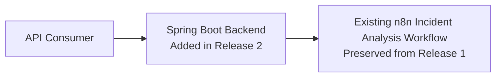

# DevStream – Phase 2 Architecture

| Item | Details |
|------|---------|
| Release | Phase 2 |
| Version | v2.0 |
| Status | Final |
| Last Updated | July 2026 |
| Author | Farha Serin Naaz |
| Related Release | Release 1 → Release 2 |

---

## Introduction

This document describes the architectural design of DevStream Release 2.

Release 2 extends the AI-powered monitoring platform introduced in Release 1 by integrating a Spring Boot backend with the existing n8n workflow. The architecture follows a modular design that separates backend services, workflow orchestration, artificial intelligence, and data persistence into independent components.

This document explains how these components interact, the responsibilities assigned to each architectural layer, and the design decisions that support future enhancements while maintaining a clear separation of concerns.

## Architecture Goals

The architecture of Release 2 is designed to achieve the following objectives:

- Separate backend services from workflow orchestration.
- Maintain a modular architecture that supports independent component evolution.
- Enable AI-assisted incident analysis without tightly coupling AI services to the backend.
- Provide reliable persistence for monitoring data and AI-generated insights.
- Support future enhancements through extensible system design.
- Improve maintainability, scalability, and readability of the overall platform.

## High-Level System Architecture

Release 2 preserves the complete n8n-based incident-processing flow established in Release 1. The architectural change in Release 2 is the introduction of a Spring Boot backend as the API entry point.

The Spring Boot backend receives API failure events and forwards them to the existing n8n incident analysis workflow. The internal workflow sequence and its integrations remain unchanged from Release 1.

Release 2 therefore extends the system by adding a dedicated backend layer without redesigning or replacing the established workflow architecture. The detailed processing sequence and service interactions are presented separately in the Request Processing Flow section.

Release 2 preserves the workflow-driven architecture established in Release 1 while introducing a dedicated backend layer using Spring Boot. The backend application acts as the primary entry point for incoming API requests and forwards them to the existing n8n workflow for processing.

The n8n workflow remains the orchestration layer responsible for coordinating the end-to-end incident analysis process. It invokes the Google Gemini API to generate AI-powered root cause analysis, stores incident and analysis data in PostgreSQL, and triggers email notifications when required.

This layered architecture promotes separation of concerns by assigning distinct responsibilities to each component. Spring Boot manages API interactions, n8n orchestrates business workflows, PostgreSQL provides persistent storage, Google Gemini delivers AI capabilities, and the notification service handles communication with stakeholders.

By introducing a backend layer without altering the core workflow logic, Release 2 improves modularity and establishes a scalable foundation for future enhancements while maintaining compatibility with the architecture introduced in Release 1.

## System Components

The following table summarizes the primary components of the Release 2 architecture and their responsibilities.

| Component | Responsibility |
|-----------|----------------|
| **Spring Boot Backend** | Acts as the primary entry point for incoming API requests, validates request data, and forwards requests to the workflow orchestration layer. |
| **n8n Workflow Engine** | Orchestrates the end-to-end incident analysis workflow by coordinating AI analysis, database operations, and notification services. |
| **Google Gemini API** | Performs AI-powered analysis of failed API requests and generates root cause analysis, probable causes, and recommended resolutions. |
| **PostgreSQL Database** | Stores incident information, AI-generated analysis, workflow results, and monitoring data for persistence and reporting. |
| **Email Notification Service** | Delivers automated incident notifications containing AI-generated insights to the configured recipients. |

## Component Interactions

The Release 2 architecture follows a layered interaction model where each component performs a well-defined responsibility.

1. API requests are received by the Spring Boot backend.
2. The backend forwards validated requests to the n8n workflow engine.
3. The workflow coordinates the overall incident analysis process.
4. Google Gemini is invoked to analyze failed API requests and generate AI-driven insights.
5. Generated analysis and incident details are persisted in PostgreSQL.
6. Email notifications are sent with the incident summary and AI recommendations.
7. The workflow completes execution and returns the processing status to the backend.

This interaction model maintains clear separation of concerns while allowing each component to evolve independently without affecting the overall architecture.

## Request Processing Lifecycle

A failed API request passes through the following lifecycle:

1. A client submits an API failure request to the Spring Boot backend.
2. The backend validates the request payload.
3. The validated request is forwarded to the n8n workflow.
4. The workflow extracts the relevant incident details.
5. Google Gemini analyzes the incident and generates AI-powered recommendations.
6. The workflow stores both the incident data and AI analysis in PostgreSQL.
7. An email notification containing the analysis is generated and sent.
8. The workflow completes execution and the backend returns the processing result.

This lifecycle ensures that every incident is consistently analyzed, persisted, and communicated through a standardized processing pipeline.

## Architectural Decisions

The following architectural decisions guided the design of Release 2:

### 1. Introduce a Dedicated Backend Layer

A Spring Boot backend was introduced to serve as the primary entry point for API requests. This separates client interactions from workflow orchestration, improving modularity and enabling future expansion of backend capabilities without affecting the workflow.

### 2. Preserve Workflow-Based Orchestration

The existing n8n workflow architecture from Release 1 was retained as the orchestration layer. This approach minimizes changes to the proven workflow while extending the system through a dedicated backend service.

### 3. Decouple AI Analysis from Business Logic

AI-powered incident analysis is delegated to the Google Gemini API instead of being implemented within the backend. This separation allows AI models to evolve independently without requiring changes to the application architecture.

### 4. Centralize Persistent Storage

PostgreSQL is used as the central repository for incident records, AI-generated analysis, and workflow results. A centralized persistence layer improves data consistency, reporting, and future analytical capabilities.

### 5. Isolate Notification Processing

Notification responsibilities remain separate from business processing. This allows communication channels to evolve independently without impacting incident analysis or workflow execution.

## Scalability Considerations

Although Release 2 is designed as a portfolio implementation, the architecture incorporates design choices that support future scalability.

- The backend layer can be expanded to support additional APIs and business services without modifying workflow logic.
- The workflow orchestration layer enables new automation steps to be introduced with minimal impact on existing processes.
- AI services can be replaced or extended with alternative models while preserving the overall system architecture.
- The database schema can accommodate additional monitoring metrics, incident categories, and reporting requirements.
- The modular architecture simplifies future integration with dashboards, authentication mechanisms, and external monitoring platforms.

## Future Architecture Roadmap

The current Release 2 architecture establishes a modular foundation for future enhancements. Potential improvements include:

- Implementing authentication and authorization for secure API access.
- Introducing asynchronous message processing to improve scalability and resilience.
- Developing a web-based dashboard for real-time incident monitoring and reporting.
- Supporting multiple AI providers through a pluggable AI service layer.
- Integrating with enterprise monitoring platforms such as Prometheus, Grafana, or other observability solutions.
- Containerizing the application and workflow components to simplify deployment across different environments.

These enhancements can be implemented with minimal architectural changes due to the modular separation of responsibilities introduced in Release 2.

## References

- [Root Repository README](../../README.md)
- [Phase 2 README](README.md)
- [Workflow Documentation](workflow.md)
- [Database Design](database.md)
- [API Documentation](api.md)
- [Engineering Decisions](engineering-decisions.md)
